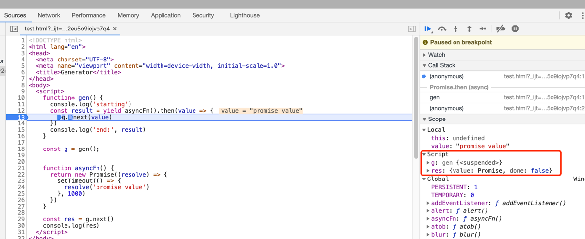

# ES6

## 发展历程

2015.6.17 日发布，是 ECMAScript 的第六个版本，所以被广泛称为 ES6 或者是 ES2015。

## 版本特性

变量声明、作用域、箭头函数、参数扩展、字符串扩展、对象扩展、数组扩展、解构赋值、模块化、class 类语法、Symbol 类型、Iterators、Generators、Map 和 Set、Promises、元编程（Proxy、Reflect）、国际化

[版本特性](http://es6-features.org/#Constants)

## 浏览器支持

[浏览器兼容表](http://kangax.github.io/compat-table/es6/)

[浏览器运行](https://babeljs.io/en/setup) ：需要使用 babel 转义。

## 变量

- 声明变量
  - es5：var function
  - es6: let const import class

- 块级作用域
  - es5规定，函数只能在顶层作用域和函数作用域中声明，不能在块级作用域声明（为了兼容性不会报错）
  - es6允许在块级作用域中声明函数，但在块级作用域外不可引用
  - 块级作用域必须有大括号

- let
  - 只在let代码块中有效
  - 不存在变量提升
  - 暂时性死区：let命令声明变量之前。该变量都是不可用的
  - 不允许重复声明

- const
  - 只在const代码块中有效
  - 不存在变量提升
  - 暂时性死区：let命令声明变量之前。该变量都是不可用的
  - 不允许重复声明
  - 一旦声明值不能改变
  - 只声明不赋值会报错
  - const 无法赋值的本质是不能改变变量的内存地址，引用类型对象指向的数据结构可变
    - ``` const a = []; a[0] = 'hello'; // 可执行 ```
    - 如果必须冻结，则可使用Object.freeze()

> 变量提升现象：变量可以在声明前调用，值为undefined

## 解构

> 解构 - 允许按照一定模式，从数组和对象中取值，对变量赋值

### 对象、数组、字符串、函数参数解构

- 解构不成功：值是undefined
- 不完全解构：左边只能匹配到右边的一部分，依然可以赋值成功
- 右边不是数组或对象（不是可遍历的结构）：报错
- 解构时允许指定默认值：``` let [foo = true] = []; ```
  - 默认值生效的情况：只有值严格 === undefined，默认值才生效 ``` let [x = 1] = [null]; // x = null ```
- 对象解构与数组解构区别：对象由属性匹配，数组按次序匹配
- 解构也可以是对象与数组的混合解构
- 解构可以取到继承的属性
- 字符串也可以由数组解构方式解构出每个字母 ``` const [a, b, c, d, e] = 'hello'; ```
- 对数值和布尔值的解构则先会转化为Number或Boolean对象
- undefined、null无法转化为对象 所以解构时会报错
- 函数参数解构 支持默认值

### 注意点

1. 以声明的变量解构时注意大括号在行首的问题

```js
// 错误写法 Uncaught SyntaxError: Unexpected token =
let x;
{x} = {x: 1}
```

```js
// 正确写法
let x;
({x} = {x: 1})
```

2. 左边可以不存在任何变量名

3. 数组可以进行对象属性解构

```js
let arr = [1,2,3]
const {0: first, [arr.length - 1]: last} = arr
```

### 解构使用场景

1. 交换变量值

```js
let x = 1;
let y = 2;
[x, y] = [y, x];
```

2. 从函数返回多个值
3. 函数参数的定义
4. 提取 JSON 数据
5. 函数参数的默认值
6. 模块变量赋值

## 箭头函数

- 箭头函数内部的this，是定义是所在的对象，而不是使用时所在的对象
  - 普通函数this可变
  - 箭头函数this是固定的
  - 箭头函数不能用call()、apply()、bind()
- 不可以当做构造函数（new）
- 不可以使用arguments对象，函数体内不存在这个对象，但可以用rest参数代替
- 不可以使用yield命令，因此不能用作Generator函数

箭头函数转换成ES5

```js
// es6
function fn() {
  setTimeout(() => {
    console.log(this.name)
  }, 1000)
}

// es5 箭头函数没有自己的this 而是引用外层的this
function fn() {
  var _this = this
  setTimeout(() => {
    console.log(_this.name)
  }, 1000)
}
```

## 数组扩展

- 扩展运算符 ...
  - 类似于 rest 参数的逆运算
  - 可以将数组转换为用逗号分隔的参数序列
  - 数组浅拷贝 `[...array]`
  - 复制数组
  - 合并数组
  - 数组空位会转换为undefined ` console.log(...[1,,2]) // 1 undefined 2 `
- flat
  - flat() 只拉平一层
  - flat(n) 拉平n层
  - flat(Infinity) 拉平任何层嵌套
  - 有空位会跳过
- flatMap
  - 等于 map flat 组合，先对所有项执行map方法，然后对所有返回值组成的数组执行flat()，返回一个新数组
  - 只能展开一层
  - 第一个参数是函数，第二参数是遍历绑定的this
- ES6会将数组空位转为undefined

## Iterator

> Iterator 遍历器是一种机制。也是一种接口，为各种不同的数据结构提供统一的访问机制。

- Iterator作用
  - 为不同的数据结构提供统一的、简便的访问接口
  - 使得数据结构的成员可以按某种次序排列
  - 主要提供for...of遍历消费

- 原生具备 Iterator 接口的数据结构、for...of 可遍历
  - Array
  - Map
  - Set
  - String
  - TypedArray
  - 函数的 arguments 对象
  - NodeList 对象

- 原生不具备 Iterator 接口的数据结构、for...of 无法遍历
  - 对象Object

为什么对象Object没有Iterator 接口或者 for...of 无法遍历？

1. 由于对象无法保证遍历顺序
2. Iterator遍历器是一种线性处理，对于任何非线性的数据结构，部署遍历接口等于是一种线性转换

## Generator

- 异步编程解决方案
- 语法上，是一种状态机
- 形式上，是一个普通函数

最大的特点是可以交出函数的执行权（暂停执行函数）

### Generator 异步操作与同步执行

下面代码，首先声明一个 generator 函数 gen，目的是让第一个 yield 语句返回 Promise 的结果，再同步打印结果。

```js
function* gen() {
  console.log('starting')
  const result = yield asyncFn().then(value => {
    g.next(value)
  })
  console.log('end:', result) // 1s后打印 end: promise value
}

const g = gen();

function asyncFn() {
  return new Promise((resolve) => {
    setTimeout(() => {
      resolve('promise value')
    }, 1000)
  })
}

const res = g.next()
console.log(res)
```

#### 问题一：result 如何同步接收 Promise 结果？

这个问题其实是 yield 语句返回值的问题。先看一段简单的代码。

```js
function* gen() {
    console.log('start')
    const result = yield 1
    console.log(result)
}
const g = gen()
console.log(g.next()) // {value: 1, done: false}
console.log(g.next()) // {value: undefined, done: true}
```

gen() 返回的是一个迭代器对象，表示 gen 函数的代码并不会立即执行，而是在调用 next() 方法后开始执行。
所以，我们可以看到在调用 g.next() 方法后，先打印 start，此时 g.next() 的返回值是 {value: 1, done: false}，所以 yield 语句后面的值并不是
`const result = yield 1` result 的值，而是迭代器 next() 方法的返回值。而 yield 语句则会暂停后面语句的执行。
最后，第二次调用 g.next() 方法，执行剩余的语句，返回 {value: undefined, done: true}， value 是 return 语句返回值，由于此时没有声明 return 语句，所以默认值是 undefined。
done 表示 generator 函数执行结束。

再看一段关于 next() 方法参数的代码 

```js
function* gen() {
    console.log('start')
    const result = yield 1
    console.log(result) // do
}
const g = gen()
console.log(g.next()) // 开始执行
console.log(g.next('do'))
```

由上面代码看出，第二个 next 放的参数是第一个 yield 语句的返回值，这是由于第一个 next 方法表示开始执行，而第二个 next 方法才继续执行第一个 yield 后的语句。

所以回到最开始的代码，result 其实是通过 next 方法接收 Promise 执行结果。

```js
const result = yield asyncFn().then(value => {
  g.next(value)
})
```

待 asyncFn 方法变成 resolve 状态，使用 then 接受 value，通过 `g.next(value)` 继续执行 gen 函数。如此，Generator 把异步操作变成了同步执行。

#### 问题二：为什么 gen 函数中可以访问实例 g 调用 g.next()

首先我们看看 js 构造函数的调用

p 引用错误
```js
function P() {
    console.log(p)
}

const p = new P()
console.log(p) // Uncaught ReferenceError: Cannot access 'p' before initialization
```

所以，在正常的函数中这种调用方式是不能正常执行的，但是 generator 函数，其实返回的是一个迭代器对象，`const g = gen()` 这个语句并不会立即执行函数，
而是第一个 g.next() 方法执行后，才开始执行 gen 函数，所以当函数执行时，g 对象其实已经被创建，所以 generator 函数执行时总是可以获取实例 g 也就是迭代器对象的内存。

通过 chrome 浏览器调试可以看到作用域中存在 g 对象



## 模块化 import、export

- ES6之前，有两种模块化加载方案：CommonJS、AMD
  - CommonJS：用于服务器，nodejs使用CommonJS模块规范，CommonJS 模块就是对象，同步加载。
  - AMD：用于浏览器，非同步加载模块，允许指定回调函数。

ES6的模块化的思想是尽量静态化，在编译时就能确定模块的依赖关系，。CommonJS和AMD只能在运行时确定这些。

```js
// ES6模块
import { stat, exists, readFile } from 'fs';

// CommonJS模块
const { stat, exists, readFile } = require('fs');
```

ES6模块化从fs模块加载三个方法，其他方法不加载，这种加载称为静态加载，静态加载可以通过代码静态分析工具和 tree shaking 优化资源。
而CommonJS是加载整个模块，生成一个对象，再从对象上读取三个方法。这种方式称为运行时加载。

## Proxy

Proxy 用于修改某些操作的默认行为，等同于在语言层面做出修改，所以属于一种“元编程”（meta programming），即对编程语言进行编程。

### 为什么要提供 Proxy ？

1. Proxy 可以创建一个对象的代理，主要是为了实现对对象操作的拦截。

基本用法
```js
const target = {
    name: 'wuqian',
    age: '28',
}
const p = new Proxy(target, {
    get(tar, key, proxy) {
        console.log(tar === target) // true
        console.log(proxy === p) // true
        console.log(arguments)
      return tar[key]
    },
    set(tar, key, value, proxy) {
      console.log(arguments)
      return value
    }
})
```
以上的用法就实现了 Proxy 对目标对象所有属性的拦截，对比 es5 的 Object.definedProperty()，Object.definedProperty() 则是修改目标对象属性的描述类型，进而实现比如对 getter 和 setter 的拦截，而 Proxy 拦截的目标则是整个目标对象而非属性。

注意点：
1. Proxy 不支持深层对象拦截。
```js
const target = {
    name: 'wuqian',
    age: '28',
    child: {
        name: 'unknown',
        age: null
    }
}
const p = new Proxy(target, {
  get(tar, key, proxy) {
    console.log(key) // child
  },
})

p.child.name // VM1068:1 Uncaught TypeError: Cannot read property 'name' of undefined
```

### Proxy 与 元编程
