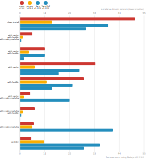
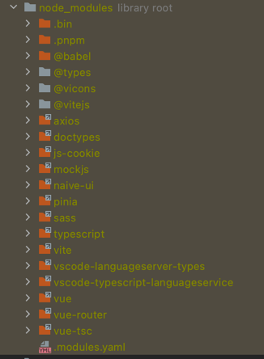
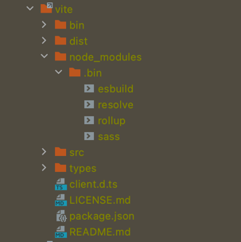

# 前端包管理工具

## 为什么需要包管理工具？

[最新内容请在掘金阅读](https://juejin.cn/post/7073738524511436813/)

每种主流编程语言都有包管理工具，比如 java 的 Maven、Gradle，Python 的 pip，nodejs 的 npm、yarn、pnpm 等。
包管理工具的主要作用是管理第三方依赖，也可以看成一个"轮子"工厂，每个人都可以上传自己造的"轮子"和下载使用别人的"轮子"，
包管理工具顾名思义就是统一管理这些轮子的软件或者工具，它以多种方式自动处理项目依赖关系、提供了命令行工具（CLI）、支持跟踪依赖项和版本等功能，
除此之外还可以安装、卸载、更新和升级包，配置项目设置，运行脚本等等。
有了包管理工具，我们可以很简单地构建一个项目或者引入和管理一个库，留给我们的则是愉快地编码。

> npm 不只是包管理工具，它是世界上最大的软件注册表（registry），每星期大约有 30 亿次的下载量，包含超过 600000 个 包，开发者使用 npm 互相分享和借鉴。

## 包管理规范

### 版本管理规范

版本管理规范 - [语义化版本控制规范 SemVer](https://semver.org/lang/zh-CN/)

在使用 npm 和 yarn 安装完依赖时，package.json 会有类似以下的版本号：

```
"vue": "^2.6.11",
"vue-router": "~3.1.3"
```

`2.6.11`、`3.1.3` 这个版本号就是遵循了 `SemVer` 语义化版本控制的规范。

SemVer规范规定，版本的格式为：主版本号.次版本号.修订号-预发版本（可选），版本号递增规则如下：

1. 主版本号：当你做了不兼容的 API 修改
2. 次版本号：当你做了向下兼容的功能性新增
3. 修订号：当你做了向下兼容的问题修正。
4. 预发布版本:
    - `alpha`（Alpha 版本，通常用于进行中的工作和实验） 
    - `beta`（Beta 版本，通常是下一个计划发布的功能完整的版本，但可能包含已知错误）
    - `rc`: 候选版本，通常是可能最终（稳定）的版本，除非出现重大错误。

在 nodejs 版本管理中，还允许使用 `～ ^ *` 字符来管理版本的范围：
- `^`: 不允许修改最左边非0版本 (`^2.6.11`:  版本 >= 2.6.11 且 < 3.0.0)
- `~`: 如果指定了次要版本，则只允许补丁版本更新，如果没有，则允许次要版本更新 (`~3.1.3`:  版本 >= 3.1.3 且 < 3.2.0)
- `*`: 任何非预发版本 (版本 >=0.0.0)

## 前端主流包管理工具

主流的前端包管理工具有 `npm`、`yarn`、`pnpm`、以及国内的镜像 `cnpm`、`tyarn` 等，这是包管理器都是基于 nodejs。

npm 是 2010 年发布的 nodejs 依赖管理工具，在此之前，前端的依赖管理都是手动下载和管理的。

yarn 是 Facebook 于 2016 年 发布的替代 npm 的包管理工具，还可以作为项目管理工具，定位是快速、可靠、安全的依赖管理工具。

pnpm 是 2017 年发布的一款替代 npm 包管理工具，具有速度快、节省磁盘空间的特点。

```
2010：npm 发布，支持 Node.js。
2016：yarn 发布，生成 yarn.lock 文件用于确定 repos 的精确版本，并且比 npm 性能更好。
2017：npm 5 发布，提供类似 yarn.lock 的 package-lock.json 文件。
2017：pnpm 发布，pnpm 具有 yarn 相对于 npm 的所有附加功能，并解决了 yarn 没有解决的磁盘空间问题。
2018：npm 6 发布，在 npm 在安装依赖项之前检查安全漏洞，提高了安全性。
2020：yarn 2 和 npm 7 发布，这两个软件包都具有出色的新功能。
2021：yarn 3 发布并进行了各种改进。
```

### yarn vs npm vs pnpm

#### 包管理工具安装和版本切换

因为 node 预装了 npm ，所以安装 node 后，不需要手动安装 npm。

相反地，yarn 需要手动安装。建议全局安装 yarn：

```bash
npm install yarn -g
```

然后，我们在项目的根目录设置需要的 yarn 版本：

```bash
# yarn set version latest # 最新版
# yarn set version canary # 最新的经典版
# yarn set version classic # 最新的经典版
# yarn set version 3.x
yarn set version <version>
```

使用 Yarn，在每个项目我们可以使用不同的版本，而在 npm 中，要安装 nvm 才能完成版本切换。

同样的，pnpm 也需要全局安装，才能使用

```bash
npm install pnpm -g
```
pnpm 其他[使用命令](https://www.pnpm.cn/motivation) 和 npm 使用方法一致。

#### 安装项目依赖

在执行 `npm install` 安装项目依赖时，依赖项是顺序安装，并且终端会输出很多的警告日志，导致覆盖报错的日志，从而难以排查问题。

使用 yarn 安装依赖时，运行 `yarn` 命令即可，yarn 是并行安装依赖项，这是它比 npm 快的原因之一，yarn 1 中的日志比较简介干净，是以树形的形式显示，但是在 yarn 2 和 yarn 3 中日志发生了变化，并不像以前直观。

并且，yarn 还支持离线安装，只要以前装过的包，可以在没有网络链接的情况下进行。yarn 具有重试机制，单个包安装失败不会导致整个安装失败。

在 yarn 安装不同版本的依赖时，会将多个版本归结为单个版本，避免创建多个副本。


#### npm 、Yarn 和 pnpm 命令

- `npm init`| `yarn init`| `pnpm init`: 初始化命令
- `npm run`| `yarn run`/`yarn` | `pnpm`: 运行脚本
- `npm publish`| `yarn publish`: 发布包
- `npm cache clean`| `yarn cache clean`：清除缓存

- `npm install`| `yarn` | `pnpm install/i`: 安装所有依赖
- `npm install [package]`| `yarn add [package]`| `pnpm add [package]`: 安装某个依赖项
- `npm install --save-dev/-D [package]`| `yarn add --dev/-D [package]`| | `pnpm add --dev/-D [package]`: 安装开发依赖
- `npm uninstall [package]`| `yarn remove [package]`| `pnpm remove/rm [package]`: 卸载依赖
- `npm update`| `yarn upgrade`| `pnpm update/up`: 更新全部依赖
- `npm update [package]`| `yarn upgrade [package]`| `pnpm update/up [package]`|: 更新某个依赖

#### 安全性

npm 最不好的缺点之一就是安全性，曾经的版本发生过几个严重的安全漏洞， npm 6 开始则是在安装之前会检查安全漏洞，
并且支持使用 `npm audit` 手动检查安装包的安全性，如果发现安全问题，可以运行 `npm audit fix` 修复漏洞。
因为 npm/yarn 是扁平化依赖结构，有个非常严重的问题就是可以非法访问未声明的包，而 pnpm 是将依赖通过 link 的形式避免了非法访问依赖的问题，如果没在 package.json 声明的话，是无法访问的。

yarn 和 pnpm 同样也支持  `yarn/pnpm audit` 手动检查安装包的安全性。

yarn 和 npm 都是使用 hash加密算法 确保包的完整性。

#### lock 文件

在 package.json 跟踪的依赖项和版本总是不准确的，因为 `~ ^ *` 等前缀表示依赖更新时对应的版本范围。
范围版本可以在更新依赖时自动升级依赖到兼容性的次要版本或者补丁版本，让软件包支持最新的功能或者修复最近的错误。

所以，为了避免不同设备安装依赖时的版本不匹配的问题，在 lock 文件中定义了精确的安装版本。在每次新装（更新）依赖时，npm 和 yarn 会分别
创建（更新） `package-lock.json` 和 `yarn.lock` 文件。这样就能保证其他设备安装完全相同的包。

在 pnpm 中，则是使用 `pnpm-lock.yaml` 文件定义依赖包的精确版本。

#### 性能对比

npm/pnpm/yarn/yarnPnp install  [性能对比](https://github.com/pnpm/benchmarks-of-javascript-package-managers#lots-of-files)

测试 `package.json` [位置](./test/package.json)

| action  | cache | lockfile | node_modules| npm | pnpm | Yarn | Yarn PnP |
| ---     | ---   | ---      | ---         | --- | --- | --- | --- |
| install |       |          |             | 51s | 14.4s | 39.1s | 29.1s |
| install | ✔     | ✔        | ✔           | 5.4s | 1.3s | 707ms | n/a |
| install | ✔     | ✔        |             | 10.9s | 3.9s | 11s | 1.8s |
| install | ✔     |          |             | 33.4s | 6.5s | 26.5s | 17.2s |
| install |       | ✔        |             | 28.3s | 11.8s | 23.3s | 14.2s |
| install | ✔     |          | ✔           | 4.6s | 1.7s | 22.1s | n/a |
| install |       | ✔        | ✔           | 6.5s | 1.3s | 713ms | n/a |
| install |       |          | ✔           | 6.1s | 5.4s | 41.1s | n/a |
| update  | n/a   | n/a      | n/a         | 5.1s | 10.7s | 35.4s | 28.3s |



根据上面的测试结果我们可以看出，首次执行 `npm install` 安装依赖时 pnpm 比 npm 和 yarn 大约快了 3 倍左右，在有缓存和已安装过依赖的情况，比 npm 也快了不少，yarn 则是更快，其他场景 pnpm 也是占了很大优势。

#### pnpm 的优势

##### 速度很快、节约空间

pnpm 的所有依赖包统一存储在 store，不会出现像 npm 或 yarn 每个项目会下载独立的依赖，yarn 是从缓存下载文件，而 pnpm 是从 store 中链接依赖，pnpm 更节约空间，
当安装某个依赖时，新项目会使用`硬链接`到 store 的这个依赖，多个项目不会出现多次安装依赖的情况，磁盘只有一次写入。 
对于依赖的不同版本，在 pnpm 中，则只会保存增量文件。比如：某个包有100个文件，如果更新版本只会修改其中的一个文件，不会因为新版本的存在而保存所有的依赖文件。
因为 pnpm 的依赖包存储在 store 同样也支持离线安装的功能。
   
##### node_modules 结构

pnpm 不会扁平化依赖书，它的 node_modules 布局使用`软链接`来创建依赖关系的嵌套结构。
pnpm 所有包都有自己的依赖项组合在一起，内部每个包使用符号链接将它们组合在一起。

一个 vue3 [项目](https://github.com/FBmm/vue3-vite-ts-pinia-naive) 的 pnpm node_modules 结构 



vite 包的 pnpm 结构



## 参考链接

- [pnpm](https://www.pnpm.cn/)
- [Why should we use pnpm?](https://www.kochan.io/nodejs/why-should-we-use-pnpm.html)
- [yarn](https://www.yarnpkg.cn/)
- [语义化版本 2.0.0](https://semver.org/lang/zh-CN/)
- [漫谈前端包管理工具](https://juejin.cn/post/7061809523777863716)


