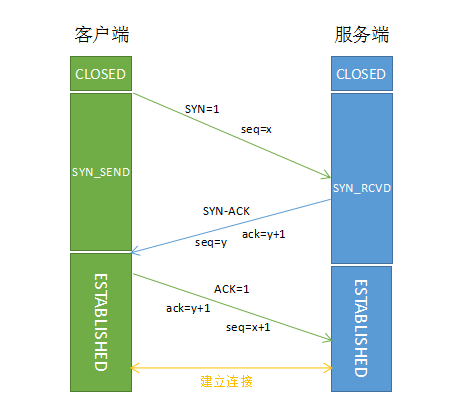

# TCP 协议

TCP 层是位于 IP 层之上，应用层之下的中间层，为应用层提供像管道一样的连接交换字节流。原则上，TCP应该能够在从硬线连接到分组交换或电路交换网络的各种通信系统之上操作。数据在 TCP 层称为流（Stream），数据分组称为分段（Segment）。

## 工作方式

TCP协议的运行可划分三个阶段：建立连接、数据传送、终止连接。

### 建立连接

TCP 用三次握手过程创建一个连接，客户端发送 SYN 连接请求，等待服务器返回的 SYN/ACK 回应，然后对 SYN 执行 ACK 确认并最终建立连接的过程。

> SYN：同步序列编号（Synchronize Sequence Numbers），TCP连接的第一个非常小的一种数据包，是建立连接时使用的握手信号。

> ACK：确认字符 （Acknowledge character），在TCP/IP协议中，如果接收方成功的接收到数据，那么会回复一个ACK数据。

#### 三次握手过程

  1. 客户端向服务器发送一个 SYN（seq=A） 请求报文，进入 SYN_SEND 状态。A 是客户端生成的随机数，表示初始序号。
  2. 服务器收到合法的 SYN 请求报文后，回应一个 SYN（seq=B）/ACK（ACK=A+1）包，进入 SYN_RECV 状态。ACK 的确认码是 A + 1，B 是 SYN/ACK 包本身携带的一个随机序号。
  3. 客户端收到 SYN/ACK 请求报文后，回应一个 ACK（ACK=B+1）包，该包的序号被设定为 A+1，而 ACK 的确认码则为 B+1。当服务器确认后，则表示TCP连接已建立，客户端进入ESTABLISHED状态。

> 为什么还要发送一次确认过程？
> 主要是防止已失效的客户端连接请求又传送到了服务端，从而产生错误。

服务器端接到了客户端发的SYN后回了SYN-ACK后客户端掉线了，服务器端没有收到客户端回来的ACK，那么，这个连接处于一个中间状态，既没成功，也没失败。于是，服务器端如果在一定时间内没有收到的TCP会重发SYN-ACK。在Linux下，默认重试次数为5次，重试的间隔时间从1s开始每次都翻倍，5次的重试时间间隔为1s, 2s, 4s, 8s, 16s，总共31s，第5次发出后还要等32s才知道第5次也超时了，所以，总共需要 1s + 2s + 4s+ 8s+ 16s + 32s = 63s，TCP才会断开这个连接。

### 终止连接

TCP 终止连接要经过四次挥手过程，在这个过程中连接的每一侧都独立地被终止。当一个端点要停止它这一侧的连接，就向对侧发送FIN，对侧回复ACK表示确认。因此，拆掉一侧的连接过程需要一对FIN和ACK，分别由两侧端点发出。